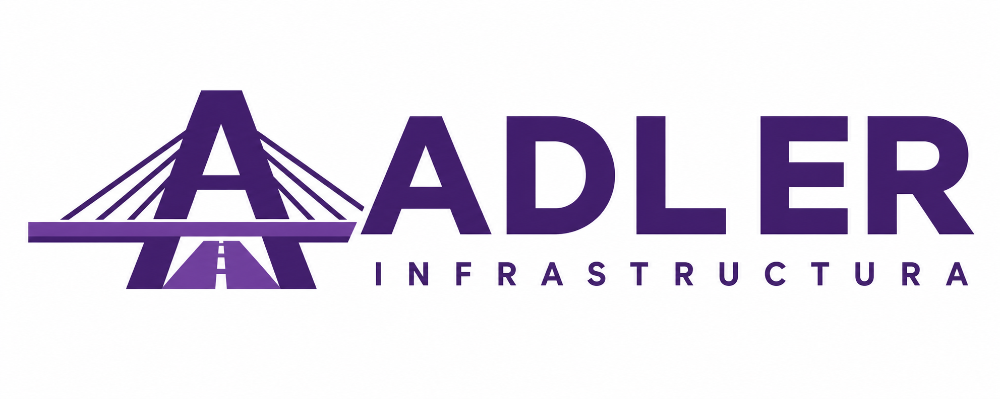

# Adler Infrastructura

Consultoría en infraestructura, gestión contractual, materiales e inteligencia artificial aplicada a empresas en Venezuela. React, Vite, Vercel y Supabase.

## Desarrollo y comprobación

```sh
npm ci
npm run dev
npm run lint
npm run build
```

La integración de GitHub con Vercel publica `main`. `vercel.json` conserva las rutas de React y las funciones de API.

## Consultas y acceso privado

- El formulario público guarda `first_name`, `last_name`, `email`, `phone`, `company` y `message` en `contacts`. El servidor deriva `name`; los nombres antiguos se conservan sin inferir apellidos. El interés por un servicio se incorpora al mensaje original.
- `/login` usa correo y contraseña de Adler; incluye recuperación de contraseña. `/dashboard` muestra la bandeja de consultas al administrador y permite descargar los resultados filtrados a Excel.
- La autorización se comprueba en PostgreSQL mediante `adler_admins`, permisos por columna y RLS. Una sesión de Supabase por sí sola no concede acceso a las consultas.
- El administrador puede buscar, filtrar, paginar y modificar exclusivamente estado y notas internas. Cada guardado comprueba `revision` para detectar cambios concurrentes.
- No se borran consultas desde la interfaz. Las notas no se envían por correo al contacto.
- La migración `supabase/migrations/20260905_private_inbox.sql` se aplica una vez. Conserva las consultas existentes, reemplaza las políticas anteriores y no crea administradores automáticamente.

### Configuración de Supabase

Mantener el acceso anónimo de Auth desactivado. El portal de clientes preparado en `/clientes` usa registro abierto con confirmación del correo; activar las altas públicas únicamente después de configurar y comprobar el envío de correo a usuarios externos. Añadir exclusivamente administradores verificados a `adler_admins`; el registro de un cliente no concede ese permiso. No usar metadata editable por el usuario para conceder acceso.

Site URL: `https://adler-infrastructura.vercel.app`. Retornos de administración: `/login` y `/cuenta/contrasena`. El portal requiere también `/clientes/acceso` y `/clientes/contrasena` bajo el mismo origen. Para otros entornos, añadir únicamente las direcciones necesarias.

Las credenciales incluidas en el cliente son públicas (anon); la privacidad depende de RLS. Es posible sustituirlas mediante `VITE_SUPABASE_URL` y `VITE_SUPABASE_ANON_KEY`. Nunca añadir una clave `service_role` o una clave de IA a una variable `VITE_*`.

El correo de Auth necesita configuración y límites adecuados al uso previsto. El servicio de correo predeterminado de Supabase está limitado; configurar SMTP propio antes de ampliar accesos. El formulario de consultas no genera notificaciones por correo ni incluye todavía un control externo contra spam.

## Asistente y contenido

El asistente dispone de orientación local y de una integración opcional con `openrouter/free` mediante la función de servidor `/api/chat`. La IA permanece desactivada salvo que existan `OPENROUTER_API_KEY` y `ADLER_CHAT_AI_ENABLED=true` en las variables privadas de Vercel. `.env.example` contiene únicamente nombres y valores no secretos. Nunca usar `VITE_` para esta clave.

El servidor construye el modelo, contexto público y restricciones de privacidad/precio, valida mensajes, impone límites por instancia y un tiempo de espera. Las respuestas del modelo se representan como texto, sin ejecutar HTML. Ante límites o errores, el chat identifica explícitamente la orientación local de respaldo. No se consultan tablas de contactos o clientes ni se guardan conversaciones del chatbot.

La integración exige proveedores ZDR sin recopilación y precios máximos de cero; no emplea modelos de pago como alternativa. Sus límites por instancia no constituyen una protección distribuida contra bots. La clave antigua de Gemini no se reutiliza: retirarla del código no la revoca ni la elimina del historial; debe revocarse en el proveedor.

Estado comprobado el 7 de septiembre de 2026: la versión publicada `d53b81912b1111c37350e8047bbcf892b1c402ea` incluye portal, directorio, exportación Excel y chatbot con IA desactivada. Las migraciones del panel, portal, fotos y nombres/exportación están aplicadas. Las nuevas altas continúan desactivadas; falta completar el correo y los retornos del portal, y comprobar operaciones autenticadas reales. OpenRouter necesita configuración y prueba real. Las guías vigentes están en [Estado de la web](../LEER_PRIMERO.md), [Gestión de clientes](../Gestion_clientes_y_datos_Adler.md) y [Mantenimiento técnico](../Mantenimiento_tecnico_Adler.md). Los scripts reutilizables siguen en `../pruebas`; los informes históricos están en `../../archivo`. La compilación y los simuladores no sustituyen la comprobación del servicio real.

Los servicios y fichas comparten `src/data/services.js`. Las imágenes son ilustrativas. Incorporar casos, cifras o acreditaciones únicamente con respaldo documental.

## Identidad visual

La marca vial en morado utiliza una A integrada con puente y carretera. Los tres PNG oficiales están en `public/brand/`; `BrandLogo.jsx` aplica el encuadre común sin deformar el dibujo. Navbar, pie, panel, portal, fichas, documentos y Excel comparten estas variantes. Los originales y la guía se conservan en `../../06_Identidad_de_marca`.

## Referencias

[Permisos RLS](https://supabase.com/docs/guides/database/postgres/row-level-security) · [Acceso por correo](https://supabase.com/docs/guides/auth/auth-email-passwordless) · [Configuración de correo](https://supabase.com/docs/guides/auth/auth-smtp)
